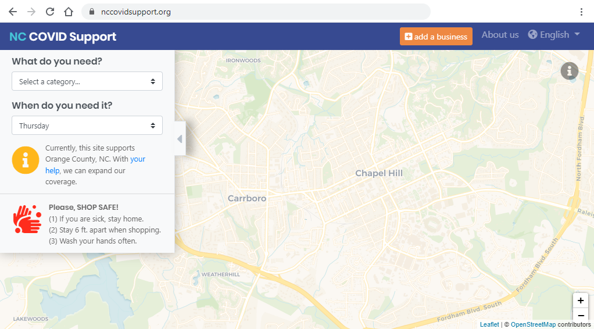

# NC COVID Support Project
<!-- ALL-CONTRIBUTORS-BADGE:START - Do not remove or modify this section -->

<!-- ALL-CONTRIBUTORS-BADGE:END -->
Created by [Code for Chapel Hill](http://www.codeforchapelhill.com/) part of [Code for America](https://www.codeforamerica.org/)

## Link to the live website: [NC COVID Support](https://www.nccovidsupport.org)

## This project is

* A mobile-friendly website with an interactive map and table of local resources.
* A tool to help our communities and neighbors navigate the COVID crisis.
* A collaborative effort connected to local officials and support organizations.
* An open project that can be quickly adapted to other locations & future needs.

## The types of resource questions we want to answer

* Where can I find a free meal?
* Where can I find free diapers/toilet paper/personal care items?
* Where can I find a drive-up pharmacy?
* Where can I find a market with senior/vulnerable shopping hours?
* Where can I find a pet store with a drive-up option?
* Which businesses offer discounts for medical workers?

## Authors

This project was initiated by [Code for Chapel Hill](http://www.codeforchapelhill.com/) with input from our local town and county officials.

## How to contribute

It is great that you are interested in helping to contribute to our project, please take a look at our [How to Contribute](/contributing.md) page for more details.

## Find us on Social Media

Please follow our social media accounts and help us to spread the word about the site.

* Twitter: [@nccovidsupport](https://www.twitter.com/nccovidsupport)
* Instagram: [@nccovidsupport](https://www.instagram.com/nccovidsupport)
* Facebook: [facebook.com/nccovidsupport](https://www.facebook.com/nccovidsupport)

## Contributors ✨

Thanks goes to these wonderful people ([emoji key](https://allcontributors.org/docs/en/emoji-key)):

<!-- ALL-CONTRIBUTORS-LIST:START - Do not remove or modify this section -->
<!-- prettier-ignore-start -->
<!-- markdownlint-disable -->
<table>
  <tr>
    <td align="center"><a href="https://www.vizioz.com"> <b>Chris Houston</b></a> <a href="https://github.com/code-for-chapel-hill/NC-COVID-Support/commits?author=readingdancer" title="Tests">⚠️</a> <a href="https://github.com/code-for-chapel-hill/NC-COVID-Support/commits?author=readingdancer" title="Code">💻</a> <a href="https://github.com/code-for-chapel-hill/NC-COVID-Support/commits?author=readingdancer" title="Documentation">📖</a> <a href="#design-readingdancer" title="Design">🎨</a> <a href="#ideas-readingdancer" title="Ideas, Planning, & Feedback">🤔</a> <a href="#platform-readingdancer" title="Packaging/porting to new platform">📦</a> <a href="https://github.com/code-for-chapel-hill/NC-COVID-Support/pulls?q=is%3Apr+reviewed-by%3Areadingdancer" title="Reviewed Pull Requests">👀</a> <a href="#translation-readingdancer" title="Translation">🌍</a> <a href="#tutorial-readingdancer" title="Tutorials">✅</a></td>
  </tr>
</table>

<!-- markdownlint-enable -->
<!-- prettier-ignore-end -->
<!-- ALL-CONTRIBUTORS-LIST:END -->

This project follows the [all-contributors](https://github.com/all-contributors/all-contributors) specification. Contributions of any kind welcome!